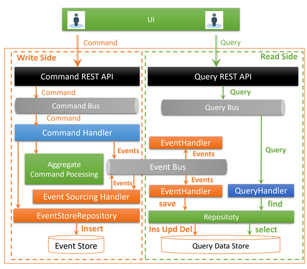
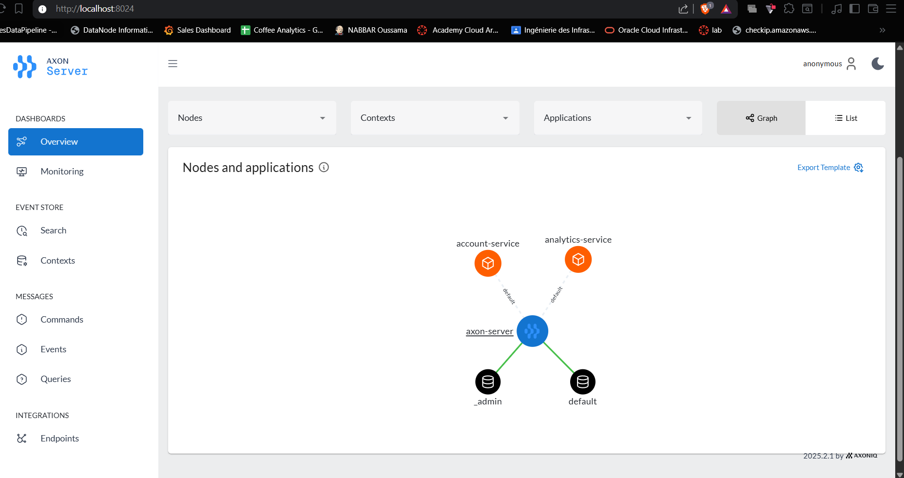
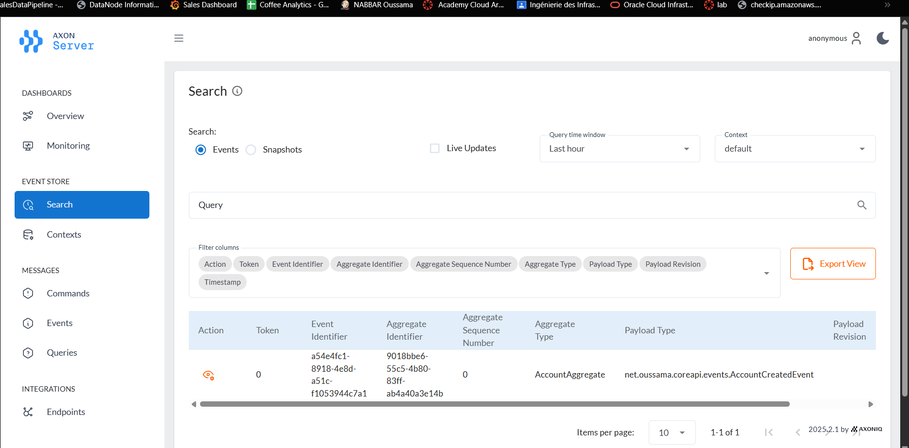
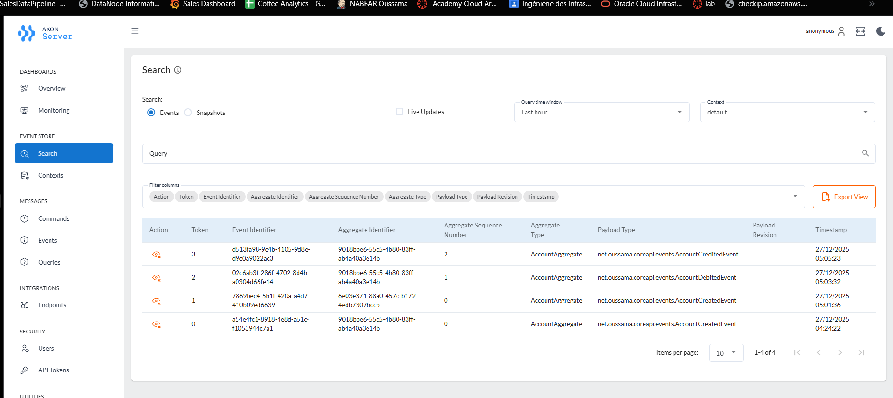
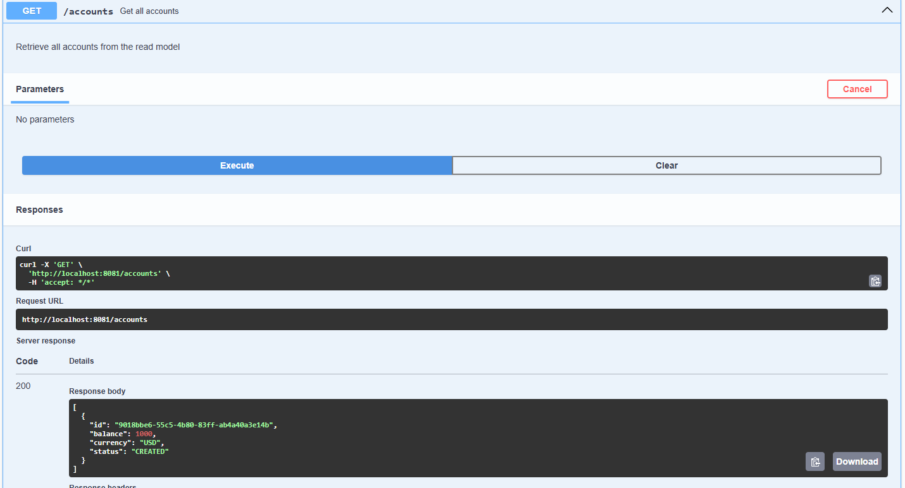
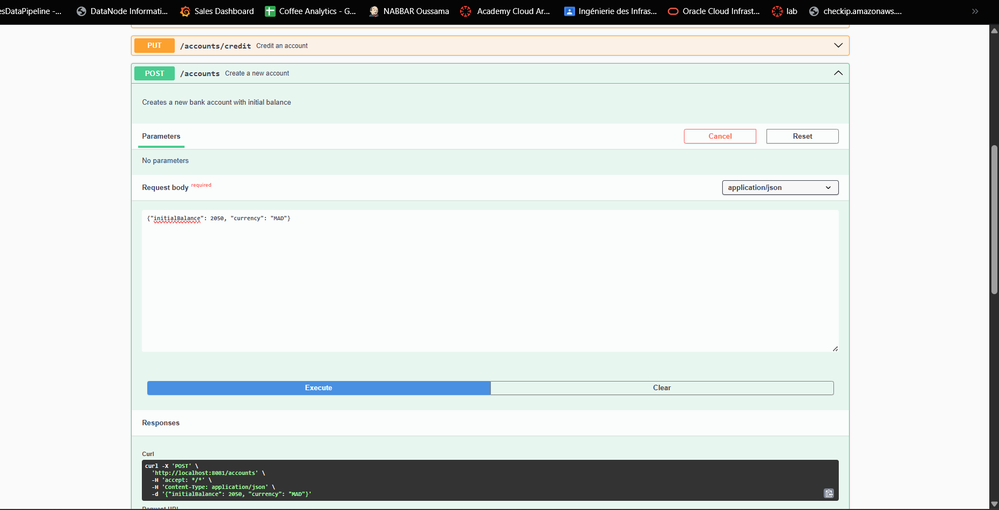
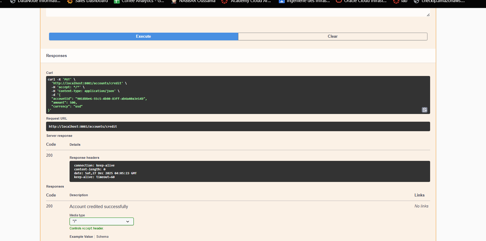
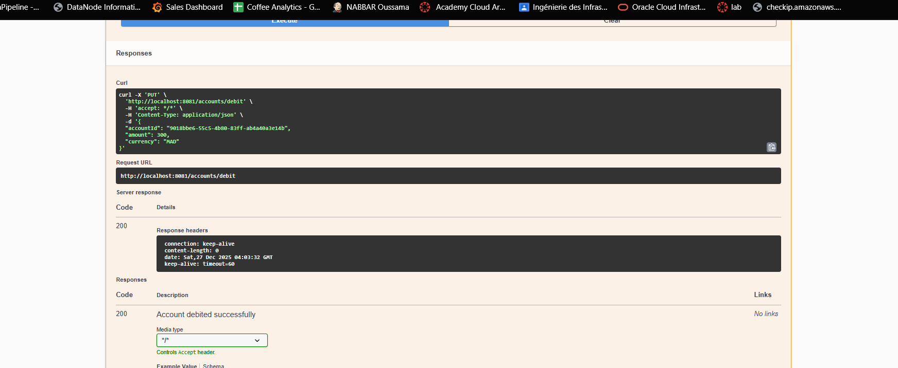
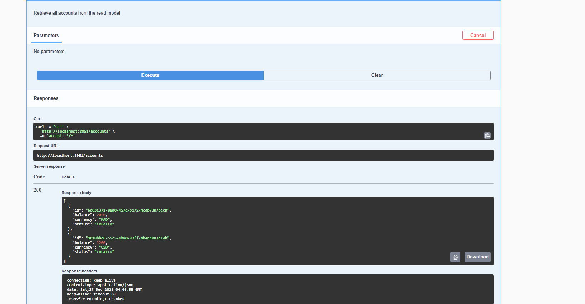

# Banking Microservices - CQRS & Event Sourcing

A distributed banking system built with **Spring Boot**, **Axon Framework**, and **Apache Kafka** demonstrating CQRS and Event Sourcing patterns.

---

## Architecture Overview

  
  
<i>High-level visualization of the CQRS and Event Sourcing flow.</i>

---

## Axon Server Dashboard

**URL**: http://localhost:8024

### Overview

_All events are stored and can be replayed_

### Search & Query

_Searchable logs for auditing and debugging specific events._

_Detailed drill-down of event payloads and metadata._

---

## Swagger UI - Interactive API Documentation

**URL**: http://localhost:8081/swagger-ui/index.html

### API Overview

_Interactive documentation for discovering available API endpoints._

### Command Endpoints (Write Side)

_Write-side endpoints for executing business commands._

---

## Testing with Swagger

### 1. Create Account

_Initiating a new account creation command._

### 2. Credit Account

_Successfully crediting an account via a command._

### 3. Debit Account

_Processing a debit request through the domain aggregate._

### 5. List All Accounts

_Querying the read-model to retrieve all existing accounts._

---

### Tables Overview

#### Accounts Table

_Relational database view of the current account states (Read Model)._

#### Account Transactions Table

*Transaction history table tracking all individual movements.*

_Aggregated transaction data for analytics and reporting._

---

## Real-time Analytics Dashboard

Access the analytics dashboard at: [http://localhost:8084/chart.html](http://localhost:8084/chart.html)

The Real-time Analytics Dashboard provides a comprehensive view of account activities through an interactive interface. It visualizes transaction trends, current account balances, and event streams in real-time. The dashboard automatically updates to reflect new transactions, with detailed information available on hover. The intuitive design features color-coded charts for easy differentiation between account balances, debits, and credits.

)
*Live dashboard displaying real-time account activities and transaction analytics*

---

## Conclusion

This project successfully implements **CQRS** and **Event Sourcing** using the **Axon Framework**. It provides a scalable, auditable, and resilient architecture for modern banking microservices, ensuring data consistency and a complete history of all transactions.
